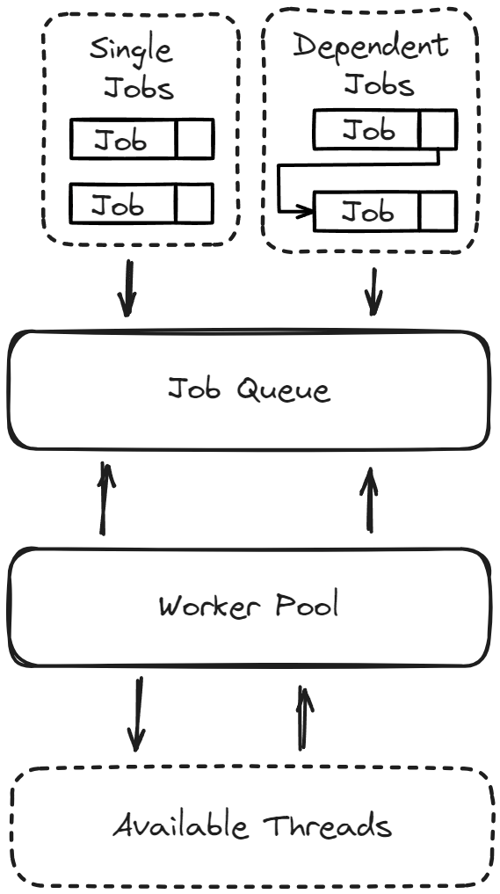

Godot Job Queueing System
===
[](https://deps.rs/repo/github/joaoh82/godot-jobqueueingsystem)
[](./LICENSE)

`Godot Job Queueing System`, is a thread-safe and synchronous Dispatch Job System for Godot. 

> What I cannot create, I do not understand. 
> — Richard Feynman



### Requirements
Before you begin, ensure you have met the following requirements:
* Godot Engine 4.2.1+

### Usage (TBD)

#### Creating a new JobQueue

```gdscript
# Instantiate - Ideally in the top of the class (Check Example)
var job_queue : JobQueue = JobQueue.new()
# Create a serial queue, which call concurrent but sets the thread number to 1
job_queue.create_serial()
# Or concurrent queue, with the number of available processors or however many threads you would like.
job_queue.create_concurrent(OS.get_processor_count())  
# (if you do neither, JobQueue will run in synchronous mode)
```

#### Distaching Single Jobs

```gdscript
job_queue.dispatch(self.job_method_name.bind("optional", "method", "arguments"))
```

#### Distaching Dependent Jobs
The second job will only start after the first has finished
```gdscript
job_queue.dispatch(self.job_method_name.bind("optional", "method", "arguments")).then(self.result_callback)
```
**Important:** The `self.result_callback` takes an `results` array an argument and should have the following signature:
```gdscript
func result_callback(result : Array) -> void:
...
```
`results` - Is of type array and has the results from the first job method, if any, otherwise will be null.


#### Distaching Jobs in Groups

```gdscript
job_queue.dispatch_group([
  self.method_name1.bind("optional", "arguments"),
  self.method_name2,
  self.method_name3,
]).then_deferred(self.group_results_callback)
```

- `dispatch_group` takes an Array of `Callable` with the option of having a callback method to be called after all jobs are done.
- The jobs passed in the `dispatch_group` will be called one after the other, but not necessarily wait for each other to finish. Just the start of the job is in sequence. This may also vary depending if you are running with more than 1 thread or not.

#### Distaching Jobs in Couroutine Style
```gdscript
var job = job_queue.dispatch(self.mymethod)
# Waits for job to be finished
var mymethod_result = await job.finished
# Dispaches a group of jobs
var job_group = job_queue.dispatch_group([self.method1, self.method2])
# Waits for all jobs in group to be finished
var group_method_results = await job_group.finished
```

#### Automatically detecting when all jobs queued are finished

```gdscript
# Connecting to signal
job_queue.all_tasks_finished.connect(self._on_all_tasks_finished)

await job_queue.all_tasks_finished
```

- JobQueue, Job and all classes extends RefCounted, so no need to worry about freeing it manually


### Contributing
**Pull requests are warmly welcome!!!**

For major changes, please [open an issue](https://github.com/joaoh82/godot-jobqueueingsystem/issues/new) first and let's talk about it. We are all ears!

If you'd like to contribute, please fork the repository and make changes as you'd like and shoot a Pull Request our way!

**Please make sure to update tests as appropriate.**

If you feel like you need it go check the GitHub documentation on [creating a pull request](https://help.github.com/en/github/collaborating-with-issues-and-pull-requests/creating-a-pull-request).

### Code of Conduct

Contribution to the project is organized under the terms of the
Contributor Covenant, the maintainer of Godot Job Queueing System, [@joaoh82](https://github.com/joaoh82), promises to intervene to uphold that code of conduct.

### Contact

If you want to contact me you can reach me at <joaoh82@gmail.com>.
