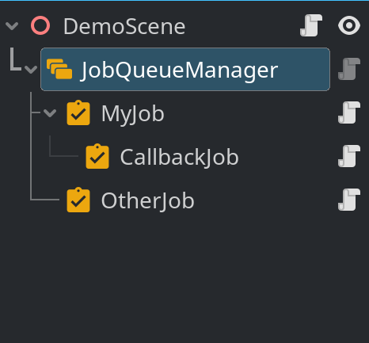
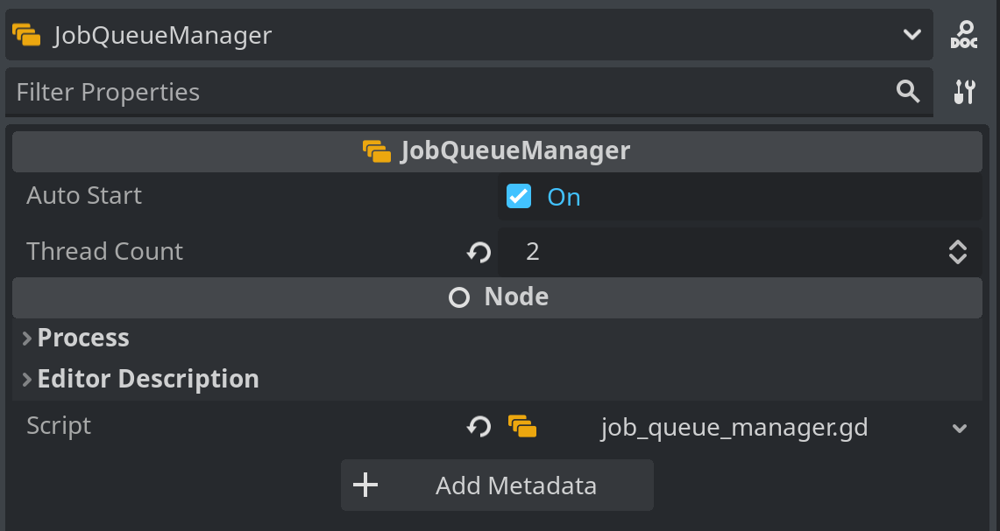
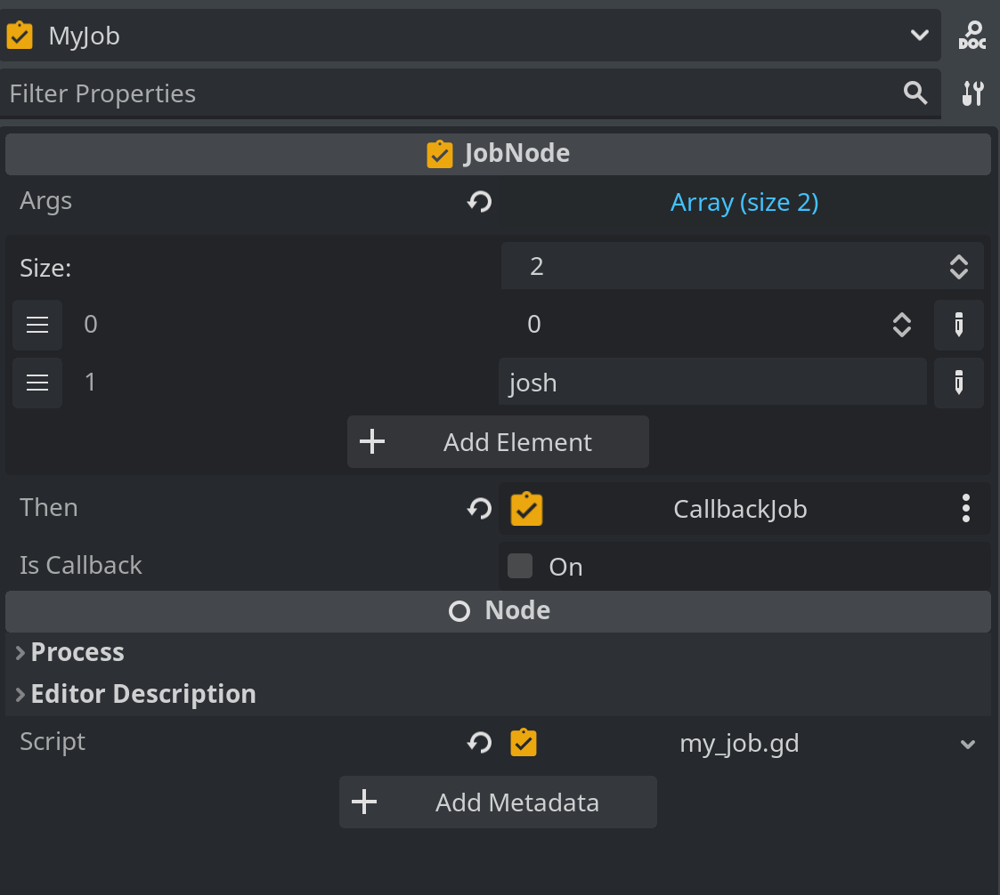

Node Based Job Queueing System
===
[](https://deps.rs/repo/github/joaoh82/nodebased-job-queueing-system)
[](./LICENSE)

`Godot Job Queueing System`, is a node based thread-safe and synchronous Dispatch Job System for Godot. 

> What I cannot create, I do not understand. 
> — Richard Feynman


### Requirements
Before you begin, ensure you have met the following requirements:
* Godot Engine 4.2.1+

## Usage

### Using the Node System




You can also use the Job Queueing System using nodes and in a very easy way.

#### Add a JobQueueManager node to your node tree and configure it in the inspector.

**Node: JobQueueManager**

Parent node that manages the jobs and abstract the JobQueue class



Properties:

`Auto Start` - Determines is jobs should start running right at the start.

`Thread Count` - Determines how many threads should be used by the Job Queueing System

**Node: JobNode**


Before adding this node to the tree you should create a script, extend from `JobNode` and implement the `execute` method.


Properties:




`Args` - Array of values of any type that will be passed as parameters to the `execute` method you implement for the node. The number of parameters and types should match the ones in the `execute` method.

`Then` - Callback JobNode to be called when this job is done. Ideally you would nest these nodes so it is easier to understand when looking at the tree.

`Is Callback` - You should check this is this JobNode is a callback of another JobNode


The callback JobNode `execute` method should always have a result parameter that is passed from the parent JobNode. And the parent JobNode `execute` should always have a result value as a return type.

**This uses a Unix approach where if you pipe one program into another, the output of one is always the input of the next one.**

### Using the classes directly

#### Creating a new JobQueue

```gdscript
# Instantiate - Ideally in the top of the class (Check Example)
var job_queue : JobQueue = JobQueue.new()
# Create a serial queue, which call concurrent but sets the thread number to 1
job_queue.create_serial()
# Or concurrent queue, with the number of available processors or however many threads you would like.
job_queue.create_concurrent(OS.get_processor_count())  
# (if you do neither, JobQueue will run in synchronous mode)
```

#### Distaching Single Jobs

```gdscript
job_queue.dispatch(self.job_method_name.bind("optional", "method", "arguments"))
```

#### Distaching Jobs with callbacks
The callback job will only start after the first has finished
```gdscript
job_queue.dispatch(self.job_method_name.bind("optional", "method", "arguments")).then(self.result_callback)
```
**Important:** The `self.result_callback` takes an `results` array an argument and should have the following signature, and since it is called via a signal call it needs to have the `result : Array` as a parameter:
```gdscript
func result_callback(result : Array) -> void:
...
```
`results` - Is of type array and has the results from the first job method, if any, otherwise will be null.


#### Distaching Jobs in Groups

```gdscript
job_queue.dispatch_group([
  self.method_name1.bind("optional", "arguments"),
  self.method_name2,
  self.method_name3,
]).then_deferred(self.group_results_callback)
```

- `dispatch_group` takes an Array of `Callable` with the option of having a callback method to be called after all jobs are done.
- The jobs passed in the `dispatch_group` will be called one after the other. This may also vary depending if you are running with more than 1 thread or not.

#### Distaching Jobs in Couroutine Style
```gdscript
var job = job_queue.dispatch(self.mymethod)
# Waits for job to be finished
var mymethod_result = await job.job_finished
# Dispaches a group of jobs after `job_finished` signal is called.
var job_group = job_queue.dispatch_group([self.method1, self.method2])
# Waits for all jobs in group to be finished
var group_method_results = await job_group.finished
```

#### Automatically detecting when all jobs queued are finished

```gdscript
# Connecting to signal
job_queue.all_jobs_finished.connect(self._on_all_jobs_finished)

await job_queue.all_jobs_finished
```

- JobQueue, Job and all classes extends RefCounted, so no need to worry about freeing it manually

## API

### **JobQueue** ([addons/jqs/job_queue.gd](addons/jqs_queue/job_queue.gd)):

`signal all_jobs_finished()`
- Emitted when the last queued Job finishes.
  This signal is emitted deferred, so it is safe to call non
  [Thread-safe APIs](https://docs.godotengine.org/en/stable/tutorials/performance/thread_safe_apis.html).


`create_serial()`
- Creates a Thread of execution to process jobs.
  If threading is not supported, fallback to synchronous mode.
  If queue was already serial, this is a no-op, otherwise
  calls `shutdown` and create a new Thread.

`create_concurrent(thread_count: int = 1)`
- Creates `thread_count` Threads of execution to process jobs.
  If threading is not supported, fallback to synchronous mode.
  If queue was already concurrent with `thread_count` Threads,
  this is a no-op, otherwise calls `shutdown` and create new Threads.
  If `thread_count <= 1`, creates a serial queue.


`dispatch(callable: Callable) -> Job`
- Create a Job for executing `callable`.
  On threaded mode, the Job will be executed on a Thread when there is one available.
  On synchronous mode, the Job will be executed on the next frame.

`dispatch_group(job_list: Array[Callable]) -> JobGroup`
- Create all jobs in `job_list` by calling `dispatch` on each value, returning the JobGroup associated with them.

`is_threaded() -> bool`
- Returns whether queue is threaded or synchronous.

`get_thread_count() -> int`
- Returns the current Thread count.
  Returns 0 on synchronous mode.

`size() -> int`
- Returns the number of queued jobs.

`is_empty() -> bool`
- Returns whether queue is empty, that is, there are no jobs queued.

`clear()`
- Cancel pending Jobs, clearing the current queue.
  Jobs that are being processed will still run to completion.

`shutdown()`
- Cancel pending Jobs, wait and release the used Threads.
  The queue now runs in synchronous mode, so that new jobs will run in the main thread.
  Call `create_serial` or `create_concurrent` to recreate the worker threads.
  This method is called automatically on `NOTIFICATION_PREDELETE`.
  It is safe to call this more than once.


### **Job** 

`signal job_finished(result)`
- Emitted after Job executes, passing the result as argument.
  The signal is emitted in the same Thread that executed the Job, so you
  need to connect with `CONNECT_DEFERRED` if you want to call non [Thread-safe
  APIs](https://docs.godotengine.org/en/stable/tutorials/performance/thread_safe_apis.html).

`then(callable: Callable, flags: int = 0)`
- Helper method for connecting to the "finished" signal.
	This enables the following pattern:
  ```gdscript
  job_queue.dispatch(job).then(continuation_callable)
  ```

`then_deferred(callable: Callable, flags: int = 0)`
- Alias for `then` that also adds `CONNECT_DEFERRED` to flags.
  ```gdscript
  job_queue.dispatch(job).then_deferred(continuation_callable)
  ```


### **JobGroup**

`signal finished(results)`
- Emitted after all Jobs in the group finish, passing the results Array as argument.
  The signal is emitted in the same Thread that executed the last pending Job, so you
  need to connect with `CONNECT_DEFERRED` if you want to call non [Thread-safe
  APIs](https://docs.godotengine.org/en/stable/tutorials/performance/thread_safe_apis.html).

`then(callable: Callable, flags: int = 0)`
- Helper method for connecting to the "finished" signal.
	This enables the following pattern:
  ```gdscript
  job_queue.dispatch_group(job_list).then(continuation_callable)
  ```

`then_deferred(callable: Callable, flags: int = 0)`
- Alias for `then` that also adds `CONNECT_DEFERRED` to flags.
  ```gdscript
  job_queue.dispatch_group(job_list).then_deferred(continuation_callable)
  ```


## Contributing
**Pull requests are warmly welcome!!!**

For major changes, please [open an issue](https://github.com/joaoh82/nodebased-job-queueing-system/issues/new) first and let's talk about it. We are all ears!

If you'd like to contribute, please fork the repository and make changes as you'd like and shoot a Pull Request our way!

**Please make sure to update tests as appropriate.**

If you feel like you need it go check the GitHub documentation on [creating a pull request](https://help.github.com/en/github/collaborating-with-issues-and-pull-requests/creating-a-pull-request).

### Code of Conduct

Contribution to the project is organized under the terms of the
Contributor Covenant, the maintainer of Godot Job Queueing System, [@joaoh82](https://github.com/joaoh82), promises to intervene to uphold that code of conduct.

### Contact

If you want to contact me you can reach me at <joaoh82@gmail.com>.
